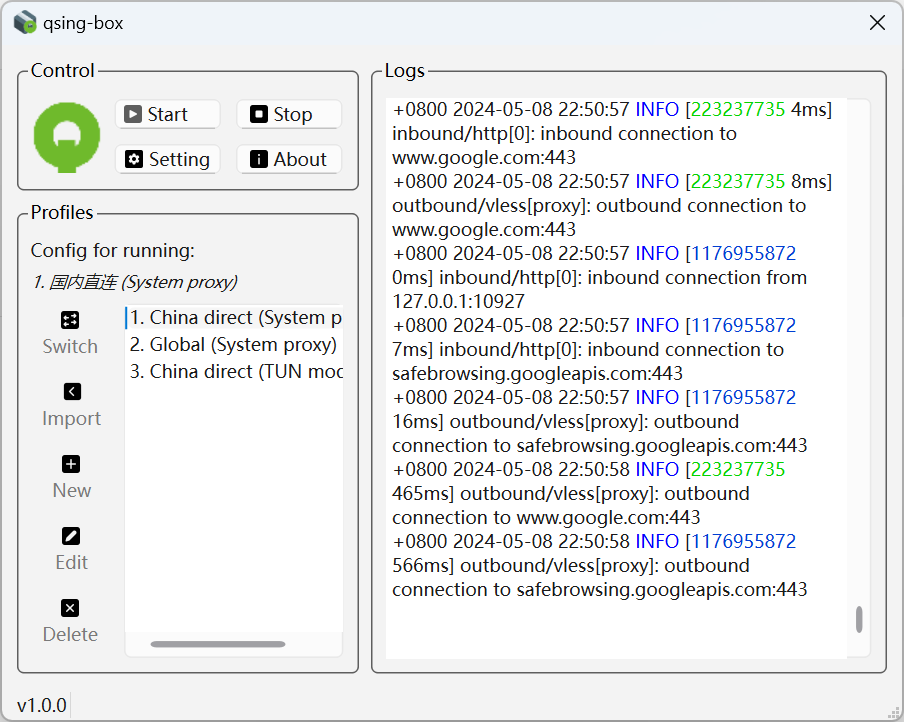
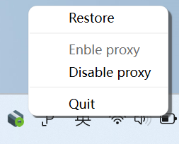
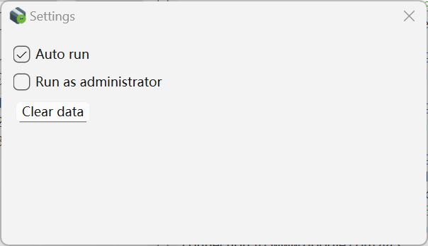

# qsing-box

[简体中文](docs/README.zh_CN.md)

A Windows GUI client for [sing-box](https://github.com/SagerNet/sing-box).
It is developed using Qt C++.

## Support operating systems

- Windows 10 x64
- Windows 11 x64

## Features

- [x] Configuration management.
- [x] Auto run at boot.
- [x] Run with administrator rights.
- [ ] Selector outbound.

## How to use

1. Download the installer or compressed package file from [Release](https://github.com/nextincn/qsing-box/releases).
2. Install or unzip the program.
3. Import the configuration file. 
4. Start the proxy.

### System proxy

Enable `set_system_proxy` in configuration file.

```
{
  "inbounds": [
    {
      "type": "http",
      ...
      "set_system_proxy": true
      ...
    }
}
```
### TUN mode

Set up a tun inbound. enable running with administrator privileges in the program settings.

```
{
  "inbounds": [
    {
      "type": "tun",
      ...
    }
}
```

## How to update sing-box core

Replace `sing-box.exe` in the installation path. The default installation path is `C:\Users\<UserName>\AppData\Local\Programs\sing-box`.

## Screenshot

### Main window

<div align="center">
  
</div>

### Running

<div align="center">
  
</div>

### Tray icon

<div align="center">
  
</div>

### Settings

<div align="center">
  
</div>

