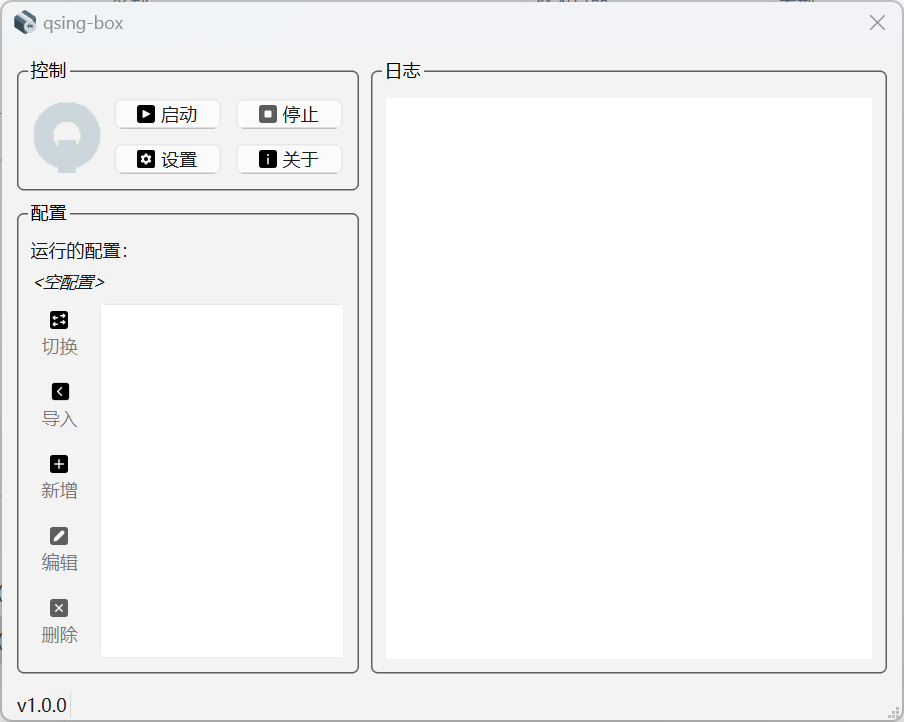
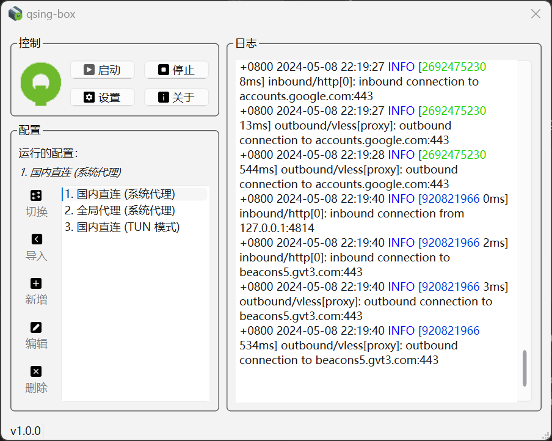
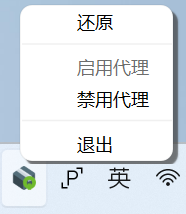

# qsing-box

[English](../README.md)

Windows 平台上的 [sing-box](https://github.com/SagerNet/sing-box) 图形用户界面程序。使用 Qt C++ 开发。

## 支持系统

- Windows 10 x64
- Windows 11 x64

## 功能

- [x] 配置管理。
- [x] 开机启动。
- [x] 以管理员权限运行。
- [ ] Selector outbound。

## 使用

1. 从 [Release](https://github.com/nextincn/qsing-box/releases) 下载安装程序或压缩包。
2. 安装或解压程序。
3. 导入配置。
4. 启动代理。

### 系统代理

在配置文件中启用 `set_system_proxy`。

```
{
  "inbounds": [
    {
      "type": "http",
      ...
      "set_system_proxy": true
      ...
    }
}
```
### TUN 模式

设置一个 tun inbound，在程序设置中启用以管理员权限运行。

```
{
  "inbounds": [
    {
      "type": "tun",
      ...
    }
}
```

## 升级 sing-box 核心

替换安装路径下的 `sing-box.exe`。 默认安装路径为 `C:\Users\<UserName>\AppData\Local\Programs\sing-box`.

## 截图

### 主界面

<div align="center">
  
</div>

### 启用代理

<div align="center">
  
</div>

### 托盘

<div align="center">
  
</div>

### 设置

<div align="center">
  
</div>
